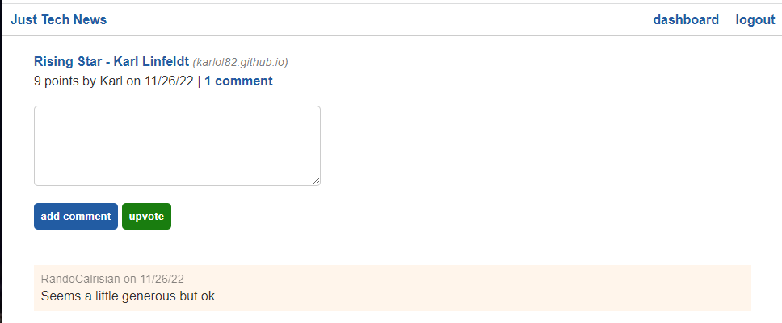

# Just Tech News
An online news bulletin where users can share links to tech-related news and projects.

## Developer Info  
- Developed by Karl Linfeldt 
- [Live Page Deployment](https://python-newsfeed-karlol82.herokuapp.com/)
- [Github Repo](https://github.com/KarlOL82/python-newsfeed)  
- [email](mailto:klinfeldt@gmail.com)  

## Development Overview  
This application was built with Javascript on the front end and Python on the back end with Flask and SQLAlchemy. This application allows users to create an account, login, make posts, and comment and upvote on others' posts. Posts can also be edited or deleted by the user who created them.  

## Running the App  
There is no installation required to use this application. Simply navigate to the Heroku deployment with the link above.The posts will be read-only unless you are logged in so you will need to sign up on your first visit with a username, email, and password. Once logged in, you can create a post with a link to the content you wish to share and interace with other posts by commenting and upvoting.  

## License
    
  https://opensource.org/licenses/MIT  

  This application is using the MIT open source license.  

## Screenshots  

  

  

  

  
